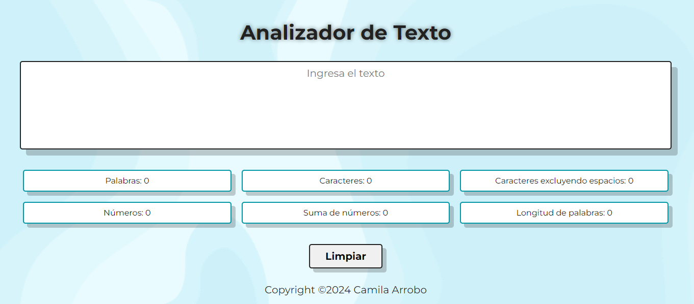
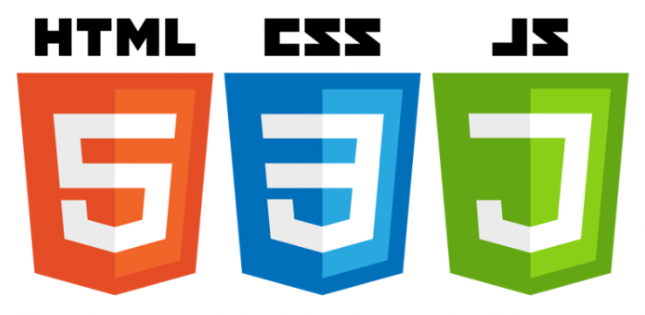

# Analizador de texto

## Índice

* [1. Introducción](#1-introducción)
* [2. Resumen del proyecto](#2-resumen-del-proyecto)
* [3. Funcionalidades del proyecto](#3-funcionalidades-del-proyecto)
* [4. Descripción de archivos](#4-descripción-de-archivos)
* [5. Criterios de diseño](#5-criterios-de-diseño)
* [6. Pruebas](#6-pruebas)

***

## 1. Introducción!

Un analizador de texto es una aplicación que permite extraer de un cadena de caracteres información útil de un texto utilizado.

Puede propocionar una variedad de métricas como: 
  * Conteo de palabras.
  * Conteo de caracteres.
  * Longitud media de palabras.
  * Número de oraciones.
  * Número de párrafos, entre otros.

En términos generales, las herramientas de análisis de texto ofrecen datos relevantes y medidas que permiten a los usuarios tomar decisiones bien fundamentadas y extraer conclusiones importantes.

## 2. Resumen del proyecto

El presente proyecto es una aplicación web de un analizardor de texto que permite a los usuario ingresar y analizar su texto en el navegador, al calcular métricas específicas sobre el número de palabras, número de caracteres, números, signos de puntuación que contiene el texto ingresado por medio del  _input_. 

En la desarroolo del proyecto se utilizó HTML, CSS y JavaScript. 

## 3. Funcionalidades del proyecto

El listado de funcionalidades del proyecto es el siguiente:

1. Permite a los usuarios ingresar un texto escribiéndolo
en un cuadro de texto.

2. Calcula las siguientes métricas y actualiza el
resultado en tiempo real a medida que los usuarios escriben su texto:

    - **Palabras**: Determina el número de
    palabras en el texto de entrada.
    - **Caracteres**: Cuenta el número de
    caracteres en el texto de entrada, incluidos espacios y signos de puntuación.
    - **Caracteres excluyendo espacios y signos de puntuación**: Calcula el número de caracteres en el texto de entrada, excluyendo espacios y signos de puntuación.
    - **Recuento de números**: Cuenta cúantos números hay en
    el texto de entrada.
    - **Suma de números**: Calcula la suma de todos los números que hay en el texto de entrada.
    - **Longitud media de las palabras**: Determina la longitud media de las palabras en el texto de entrada.

3. La aplicación limpia el contenido de la caja de texto haciendo clic en un botón.

## 4. Descripción de archivos

La lógica del proyecto está implementada completamente en JavaScript. En este proyecto no se utilizan librerías o frameworks, solo JavaScript puro también conocido como Vanilla JavaScript.

* `README.md`: Documento que explica la información sobre el proyecto, su funcionalidad, archivos y criterios de diseño que se tomaron.
* `.github/workflows`: Esta carpeta contine la configuracion para la ejecution de Github Actions. 
* `read-only/`: Esta carpeta contiene las pruebas de criterios mínimos de aceptación y end-to-end. No debes modificar esta carpeta ni su contenido.
* [`src/index.html`](./src/index.html): Contiene el archivo que utiliza el HTML semático.
* [`src/style.css`](./src/style.css): En este archivo se generaron las reglas de estilo de la aplicación web. 
* [`src/analyzer.js`](./src/analyzer.js): Este archivo contiene el objeto  `analyzer`, que realizar los siguientes métodos:
  - `analyzer.getWordCount(text)`: Esta función calcula el número de palabras que se encuentran en el parámetro`text` de tipo `string`.
  - `analyzer.getCharacterCount(text)`: Esta función determina el total de caracteres se encuentran en el parámetro `text` de tipo `string`.
  - `analyzer.getCharacterCountExcludingSpaces(text)`: Está función calcula el número de caracteres excluyendo espacios y signos de puntuación que se encuentran en el parámetro `text` de tipo `string`.
  - `analyzer.getNumberCount(text)`: Esta función evalúa cuántos números se encuentran en el parámetro `text` de tipo `string`.
  - `analyzer.getNumberSum(text)`: Esta función realiza la suma de todos los números que se encuentran en el parámetro `text` de tipo `string`.
  - `analyzer.getAverageWordLength(text)`: Esta función determinar la longitud media de palabras que se encuentran en el parámetro `text` de tipo `string`.

* [`src/index.js`](./src/index.js): En este archivo se escucha los eventos del DOM, y se invoca los métodos del objeto `analyzer` según sea necesario y se actualiza el resultado
  en la UI (interfaz de usuaria).
* [`test/analyzer.spec.js`](./test/analyzer.spec.js): Este archivo contiene las pruebas unitarias para los métodos del objeto `analyzer`.

***

## 5. Criterios de diseño

Se describen los criterios de diseño que se tomaron en el proyecto.

### HTML

* **Uso de HTML semántico**

  - Tiene un encabezado conformado por un `<header>`
  que es padre de un `<h1>` con el título `Analizador de texto`. No posee atributos `id`, ni `name`, ni `class`.

  - La aplicación usa un `<textarea>` con un el atributo `name` en el valor `user-input`, es lo que permite ingresar el texto a los usuarios. No contiene atributos `id`, ni `class`.

  - La aplicación usa un `<ul>` con 6 hijos `<li>`, uno para mostrar cada métrica. Los hijos `<li>` no pueden tener atributos `id` ni `name` ni hijos.

  - El `<li>` que muestra el total de  _palabras_ tiene el atributo `data-testid` con valor `word-count`.

  - El `<li>` que muestra el total de _caracteres_ tiene el atributo `data-testid` con valor `character-count`.

  - El `<li>` que muestra el total de _caracteres excluyendo espacios y signos de puntuación_ posee el atributo
  `data-testid` con valor `character-no-spaces-count`.

  - El `<li>` que muestra el total de _números_ tiene el atributo `data-testid` con valor `number-count`.

  - El `<li>` que muestra la _suma total de números_ posee el atributo `data-testid` con valor `number-sum`.

  - El `<li>` que muestra la _longitud media de palabras_ tiene el atributo `data-testid` con valor `word-length-average`.

  - El `<footer>` es padre de un `
` que tiene como texto el nombre de la persona que desarrolló la aplicación.

  - Posee un `<button>` con el atributo `id` en el valor `reset-button` para permitir a los usuarios, mediante un clic, limpiar el contenido de la caja de texto.

### CSS

* **Uso de selectores de CSS**

  - La aplicación usa `selectores CSS de tipo` para darle estilo al `<header>` y al `<footer>`.

  - La aplicación usa `selectores CSS de class` para darle estilo a los `<li>`.

  - La aplicación usa `selectores de atributo` para darle estilo al `<textarea>` usando el atributo `name`.

  - La aplicación usa `selectores CSS de ID` para darle estilo al `<button>` con el atributo `id` en el valor `reset-button`.

* **Modelo de caja (box model): border, margen, padding**

  - Las `clases css` de los `<li>` hijos del `<ul>` definen un estilo usando las propiedades del modelo de caja, `background`, `border`, `margin`, `padding`.
  - El `<ul>` define un display: grid de 2 filas y 3 columnas para la ubicación de los `<li>`.

### Web APIs

* **Uso de selectores del DOM**

  - La aplicación usa el `selector del DOM querySelector` para llamar a todos los `<li>` y al textarea.

  - La aplicación usa el `selector del DOM getElementById` para llamar al botón.

* **Manejo de eventos del DOM (listeners, propagación, delegación)**

  - La aplicación registra un Event Listener para escuchar el evento `input` del `<textarea>` y actualizar las métricas
  cuando se haga escriba en el cuadro de texto.

  - La aplicación registra un Event Listener para escuchar el evento `click` del `<button>` que limpia el contenido de la
  caja de texto.

* **Manipulación dinámica del DOM**
  - La aplicación actualiza el atributo `textContent` de los `<li>` para mostrar las métricas del texto en tiempo real.

### JavaScript

* **Tipos de datos primitivos**

  - La aplicación convierte valores tipo `string` a tipo `number`.

* **Strings (cadenas de caracteres)**

  - La aplicación usa métodos para manipular strings como `split` que utiliza para generar un array con las palabras de la cadena de texto ingresada cada elemento del array es separado con un espacio, `trim` se utiliza para quitar los espacio de la cadena de caracteres y `replace` que se utiliza para que dentro de la cadena de texto reemplazar ciertos caracteres por otros.

* **Variables (declaración, asignación, ámbito)**

  - La aplicación declara variables con `let` y `const`.

  - La aplicación NO declara variables con  `var`.

* **Uso de condicionales (if-else, switch, operador ternario, lógica booleana)**

  - La aplicación usa el statement `if..else`
  para evaluar condiciones y determinar si los arrays que creamos en nuestros código cumplen con las condiciones estableciones. Estos condicionales se utilizaron analyzer.js para la funciones que calcula el total de números y la suma total de los números de nuestra texto ingresado.

* **Uso de bucles/ciclos (while, for, for..of)**

  - La aplicación usa el statement `for` para crear un bucle es iterar en los arrays que creamos y así analizar los elementos de nuestro array y con eso poder calcular la longitud media de las palabras, el total de números y la suma de los número del texto.

* **Funciones (params, args, return)**

  - El objeto `analyzer` contiene seis método `getWordCount`,`getCharacterCount`, `getCharacterCountExcludingSpaces`, `getNumbersCount`, `getNumbersSum` y `getAverageWordLength` para calcular el recuento de palabras, caracteres, caracteres excluyendo espacios y signos de puntuación, recuento de número, la suma de los números y la longitud media de las palabras de un texto,. Para ello utilizamos parámetro `text` y return el valor final calculado en cada uno de los seis métodos.

* **Pruebas unitarias (unit tests)**

  - Se pasan todas las pruebas unitarias.

* **Módulos de ECMAScript (ES Modules)**

  - La aplicación usan `import` y `export` para importar  y exportar valores desde nuestros archivos `index.js` al `analyzer.js`.

* **Uso de linter (ESLINT)**

  - Se utilizó la herramiento de dar formato al archivo de visual studio code para eliminar los errores del formato y pasar todas las pruebas.

* **Uso de identificadores descriptivos (Nomenclatura y Semántica)**

  - En el código se utilizan identificadores descriptivos para variables y funciones.

## 6. Pruebas

### Pruebas unitarias

Una prueba unitaria es una técnica de prueba de software en la que se comprueba que cada componente individual de un programa o sistema funciona correctamente de manera aislada. En otras palabras, se prueba cada unidad de código por separado para asegurarse de que cumpla con los requisitos y especificaciones.

Las pruebas unitarias de este proyecto ejecutarán los métodos `getWordCount`, `getCharacterCount`, `getCharacterCountExcludingSpaces`, `getNumbersCount`, `getNumbersSum` y `getAverageWordLength` con diferentes argumentos y se confirmará que los valores retornados sean los esperados.

Puedes ejecutar estas pruebas con el comando `npm run test`.

### Pruebas de criterios de diseño

Estas pruebas analizarán los archivos
[`index.html`](src/index.html),
[`index.js`](src/index.html),
[`analyzer.js`](src/analyzer.js)
y
[`style.css`](src/style.css)

Puedes ejecutar todas estas pruebas con el comando `npm run test:oas`

Puedes ejecutar las pruebas de cada grupo de objetivos de aprendizaje de manera individual con los siguientes comandos:

* `npm run test:oas-html`
* `npm run test:oas-css`
* `npm run test:oas-web-api`
* `npm run test:oas-js`

#### Pruebas end-to-end

Una prueba end-to-end (E2E) es una técnica de prueba de software en la que se verifica el funcionamiento de todo el sistema desde el inicio hasta el final. En otras palabras, se prueba el flujo completo del software, simulando la interacción de la usuaria con la aplicación, para asegurarse de que todas las partes del sistema funcionan correctamente en conjunto.

Puedes ejecutar estas pruebas con el comando `npm run test:e2e`.
